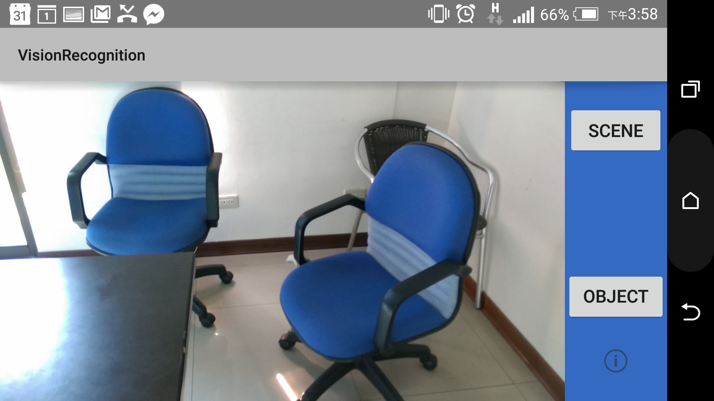
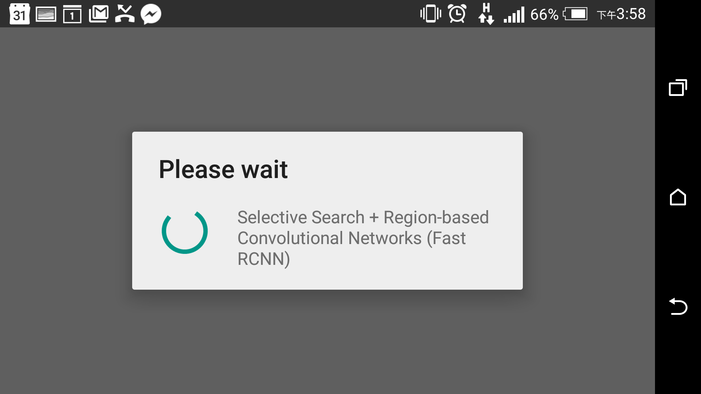
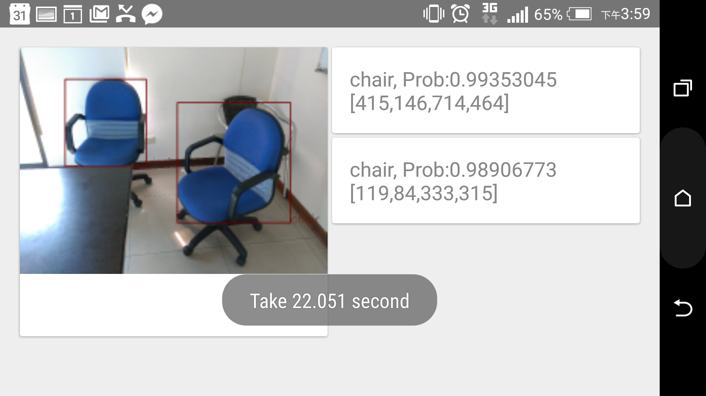
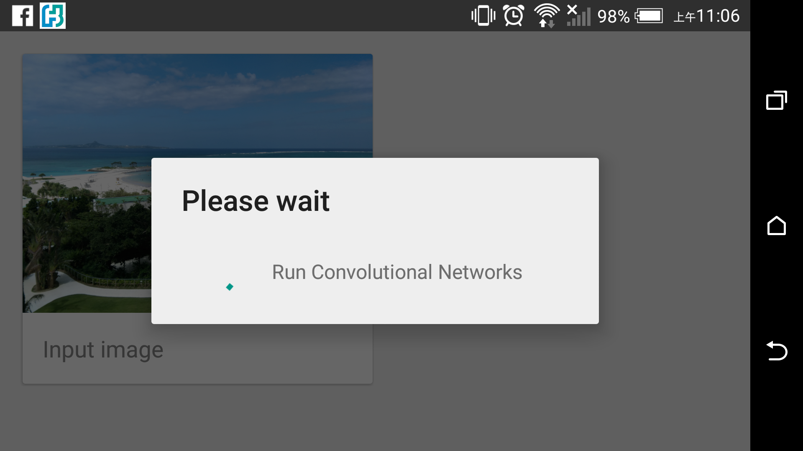
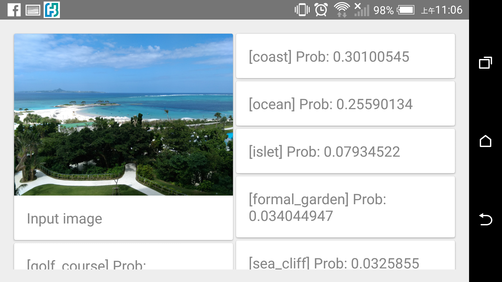

# Android-Caffe-Demo

## Requirements
* Android 4.0+ support

* ARMv7 and x86_64 based devices

* Get the Caffe model and push it to Phone SDCard

    `$ ./setup.sh`

* Build with Gradle. You can use Android studio to build or $ ./gradlew

## Feature
* [Object detection - Region-based Convolutional Networks detection](http://arxiv.org/abs/1504.08083)
[Selective Search on Android](https://github.com/tzutalin/dlib-android) + [FastRCNN](https://github.com/rbgirshick/caffe-fast-rcnn)

* [Scene recognition - Convolutional neural networks trained on Places](http://places.csail.mit.edu/downloadCNN.html)
 Input a picture of a place or scene and predicts it.

## Demo











## Usage 

* There should be model and weight in /sdcard/fastrcnn and /sdcard/vision_scene after $ ./setup.sh

* Build and run the application

Besides, you can change deep learning's model, weight, etc in VisionClassifierCreator.java
``` java

public class VisionClassifierCreator {
    private final static String SCENE_MODEL_PATH = "..";
    private final static String SCENE_WIEGHTS_PATH = "..";
    private final static String SCENE_MEAN_FILE = "..";
    private final static String SCENE_SYNSET_FILE = "..";

    private final static String DETECT_MODEL_PATH = "..";
    private final static String DETECT_WIEGHTS_PATH = "..";
    private final static String DETECT_MEAN_FILE = "..";
    private final static String DETECT_SYNSET_FILE = "..";
 }
``` 

## Todo
Speed up object detection

## License

	    Copyright (C) 2015 TzuTaLin
	
	Licensed under the Apache License, Version 2.0 (the "License");
	you may not use this file except in compliance with the License.
	You may obtain a copy of the License at
	
	     http://www.apache.org/licenses/LICENSE-2.0
	
	Unless required by applicable law or agreed to in writing, software
	distributed under the License is distributed on an "AS IS" BASIS,
	WITHOUT WARRANTIES OR CONDITIONS OF ANY KIND, either express or implied.
	See the License for the specific language governing permissions and
	limitations under the License.
